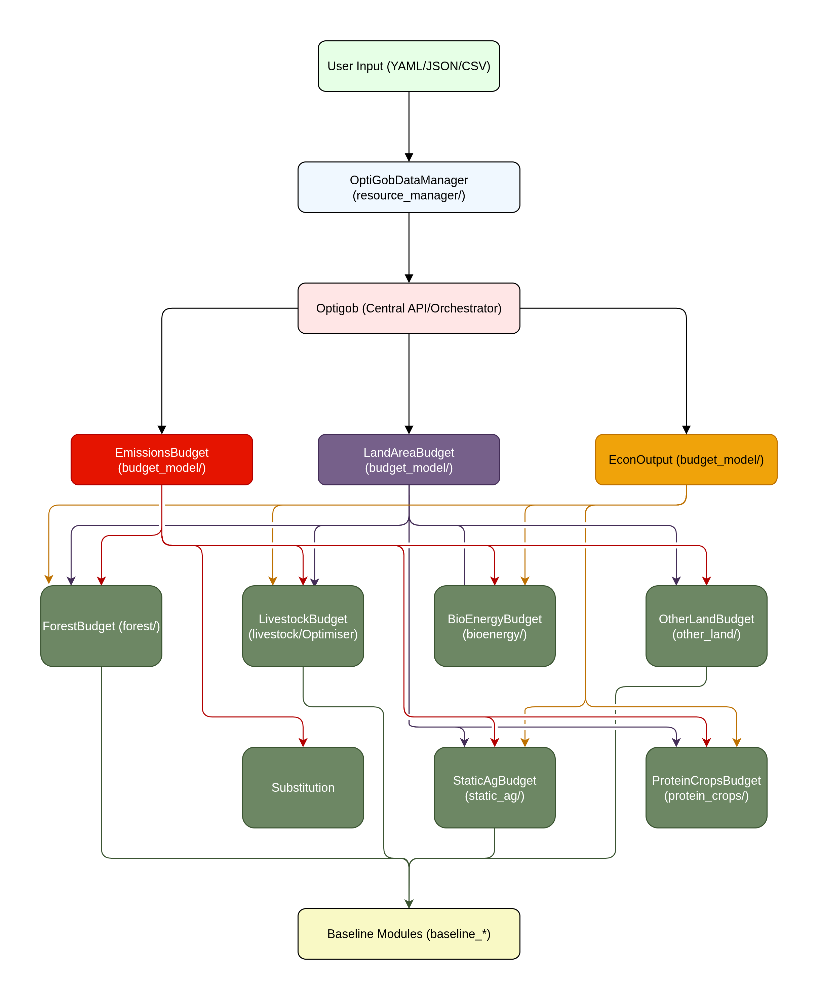

# Summary

`OptiGob` is a Python-based tool designed to explore configurations of Ireland’s agriculture, forestry, and other land use (AFOLU) sectors. The main purpose is to assist users in the assessment of environmental and economic impact pathways, based on different land use transition pathways under varying assumptions about agricultural, afforestation, emissions abatement, and carbon dioxide removal (CDR) strategies. `OptiGob` combines data outputs from the GOBLIN Lite for agriculture and land use, from FERS-CBM for forestry, and from the LCAD2.0 for anaerobic digestion, to generate scenarios that respect biophysical constraints. `OptiGob` provides a flexible, customisable, tool for researchers, policymakers, and educators to explore environmental and economic trade-offs associated with land use transition pathways.

# Statement of need

Ireland's agricultural landscape is dominated by grassland, supporting extensive dairy and suckler beef production. Investment in Ireland's bio-economy requires substantial changes to the AFOLU sector. `OptiGob` allows users to manipulate critical AFOLU levers that determine transition pathways to explore their impacts. `OptiGob` utilises data from GOBLIN Lite [@Duffy:2024; @DuffyB:2022], FERS-CBM [@Black:2025; @Kurz:2008], and LCAD2.0 [@Martinez-Acre:2025] to calculate outputs from agriculture, forestry, and anaerobic digestion.

`OptiGob` estimates the net greenhouse gas (GHG) emissions from land use change and estimates available emissions and land budget for grass-based livestock (Dairy and Suckler cow) production. `Pyomo` [@bynum2021pyomo; @hart2011pyomo] is used to optimise livestock populations, while respecting area commitment (afforestation, anaerobic digestion, BECCS (Bioenergy with Carbon Capture and Storage), protein crops) and emission (CO~2~e in the case of net-zero, or CH~4~ alongside net-zero CO~2~e for N~2~O and CO~2~ under a split gas target) constraints.

The GOBLIN framework has been applied in recent studies of net-zero pathways for AFOLU [@Henn:2025; @Bishop:2024; @DuffyB:2022]. `OptiGob` builds upon this framework, offering insight into synergies and trade-offs with reduced overhead and complexity.

# Model Overview

Figure 1 illustrates the architecture of the `OptiGob` model. User-defined parameters are provided via JSON or YAML input files and parsed by a data manager, which supplies values to the relevant sub-modules. The `OptiGob` class orchestrates the overall model flow, coordinating modules for emissions, land area, and economic outcomes. Arrows represent data flow and dependencies, showing how these modules query sector-specific modules for forestry, livestock, bio-energy, other land uses, static agricultural (crops, sheep, pigs, poultry, and protein crops), and substitution effects. Scenario data are read from a pre-generated SQLite database derived from GOBLIN Lite, FERS-CBM, and LCAD2.0.

`OptiGob` explores Ireland’s AFOLU sector under alternative assumptions regarding productivity, emissions abatement, land use change, and carbon dioxide removal (CDR).

The workflow first estimates CDR from forestry, harvested wood products, and BECCS to 2050. Fixed emissions from land use, crop production, pigs, poultry, and anaerobic digestion are then subtracted. The remaining emissions budget, defined by a GWP~100~ (100-year Global Warming Potential) net-zero target or a split-gas CH~4~ target, is used to optimise allowable cattle production via Pyomo, subject to land and emissions constraints. However, while the model optimises livestock populations (dairy and suckler beef) to meet constraints, it does not guarantee that net-zero or split-gas targets are achieved. Rather, it reports whether a given scenario is compliant.

Three levels of agricultural abatement are included: baseline (no additional measures), MACC-level (full implementation of measures in the Teagasc 2023 MACC [@MACC:2023]), and “frontier” (a high ambition pathway including grass-clover swards, methane inhibitors, anaerobic digestion, and manure management technologies).

Agricultural productivity is selectable at three tiers. More ambitious scenarios assume higher milk yields and shorter beef finishing times by 2050. National herd structure is user-defined by the ratio of dairy to suckler beef cows. `OptiGob` allows expansion of protein crop areas (e.g., field beans and peas).

# Example Output

An illustrative example is provided for a 2050 climate neutrality target year, using a 2020 baseline and a split-gas approach. The CH~4~ emissions are reduced by 30% relative to the baseline, while CO~2~ and N~2~O are balanced under GWP~100~.

Parameter selection reflects the 'frontier' (strong productivity increase) abatement path. The 10:1 dairy-to-beef ratio reflects a dairy-dominated pathway. A higher afforestation rate (16 kha per year), with a composition of 70:30 conifer to broadleaf split. BECCS and bio-energy (anaerobic digestion and willow) are also included. Wetland restoration is assumed to be 90% of exploited peatland, and 50% of organic soils under grass rewetted. Pig and poultry output has also been increased by 20%.

Figure 2 shows the emissions and removals by category for the baseline and transition scenario.

Figure 3 shows total area breakdown by category for the baseline and transition scenario.

Figure 4 shows the total protein output by category for the baseline and transition scenario. Given the variability in composition of non-protein crops, and the relatively small contribution to the overall protein value, static crops have not been included.  

# Acknowledgements

This research was supported by EPA Research 2030, funded by Ireland's Environment Protection Agency under grant number EPA-CCRP-MS.57, and by Ireland's Department of the Climate, Energy and the Environment under FORESIGHT land use modelling services contract.

# References
